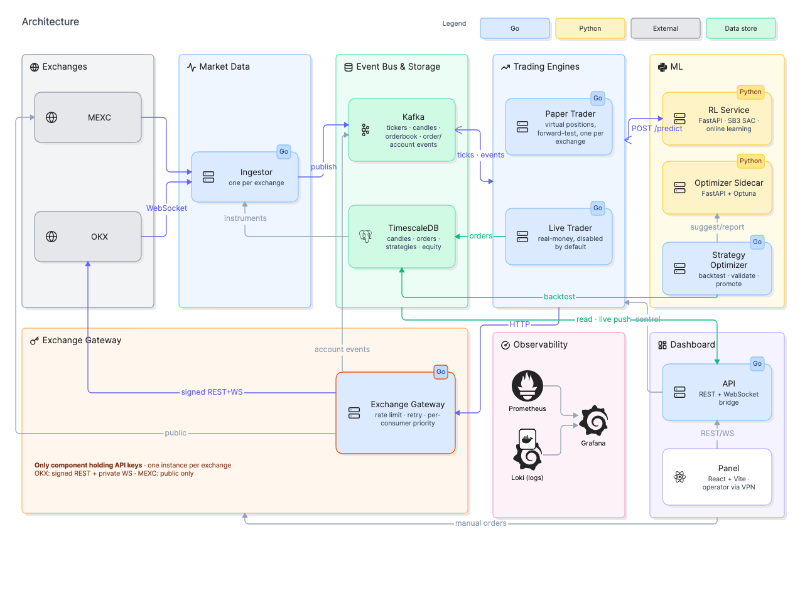

<div align="center">

# okxBot

**A reinforcement-learning futures trading bot, built on a hybrid Go + Python architecture.**

Go handles realtime market data, order execution, and hard risk limits.
Python trains and serves the reinforcement-learning agent that decides position sizing, leverage, and in-trade risk management.

The exchange layer is a pluggable adapter behind a single interface, not a hardcoded integration —
adding a new exchange means writing one adapter, not touching the trading engine, the risk manager,
or any business logic. Two exchanges (OKX and MEXC) are supported today.

[](https://github.com/eghbalii/okxBot/actions/workflows/ci.yml)
[](https://go.dev)
[](https://www.python.org)
[](https://www.typescriptlang.org)
[](https://pytorch.org)
[](https://kafka.apache.org)
[](https://www.timescale.com)
[](https://www.docker.com)
[](#pluggable-exchange-adapters)

</div>

---

## What this is

okxBot is a futures/perpetual-swap trading system where a **Soft Actor-Critic (SAC) reinforcement-learning
agent** decides *how* to trade — position sizing, leverage, and when to adjust or close a position —
while classic technical/price-action **strategies** decide *when* there's a setup worth acting on
in the first place. The RL agent never overrides a strategy's chosen direction; it decides how much
risk to take on it, and can learn to trust some strategies more than others from their live,
running track record.

It's a real, end-to-end system rather than a backtesting toy:

- 🔌 **Live market data** streamed from the exchange over WebSocket, fanned out through Kafka
- 📊 **60+ built-in strategies** — moving averages, RSI/MACD/Bollinger/Keltner, ICT/smart-money
  concepts (order blocks, fair value gaps, liquidity sweeps), classic price-action patterns, and a
  few structural additions (a confluence combiner, a BTC-divergence strategy, a regime filter)
- 🧠 **One shared RL policy** trained on pooled experience across every traded instrument, served
  over a small FastAPI inference service and (optionally) kept learning continuously from live
  outcomes
- 🧪 **A paper-trading engine** that is the actual training-data source — not a toy backtest, a
  forward-test loop that opens virtual positions against the live price feed and closes them on
  real stop-loss/take-profit touches
- 🕰️ **A full backtesting engine** (`cmd/backtest`) that replays historical candles through the
  exact same strategy implementations and the exact same observation-building code the live system
  uses — no reimplementation, no train/serve skew by construction. It's used two ways: to score
  every strategy's statistical edge against a null baseline before trusting it with real capital,
  and to build a warm-start training dataset that pretrains the RL model before deployment, so a
  fresh install doesn't need weeks of live data before the policy produces anything better than
  random noise
- 🛡️ **Hard, RL-independent risk limits** in Go — max leverage, max exposure, a loss cap enforced
  at multiple redundant layers, liquidation-distance floors — so nothing the model outputs can
  exceed them
- 🔒 **Idempotent order state transitions** — every close path (SL/TP touch, manual close, model
  early-close) guards on the row's own `closed_at IS NULL`, so two racing callers can never double-close
  or double-count the same position
- 🔌 **Per-connection WebSocket concurrency** — each exchange WS client runs its own read/write/heartbeat
  goroutines with reconnect handling, independently for OKX and MEXC
- 🔀 **A clean ports-and-adapters architecture** — the trading engine, risk manager, and every
  use-case depend only on interfaces, never on a specific exchange's SDK. Adding an exchange means
  writing one adapter that satisfies `port.ExchangeClient`; nothing else changes. Proven by
  supporting two independent exchanges (OKX and MEXC) today, verified by a static test that fails
  the build if application logic ever imports an exchange package directly
- 📈 **A full operator dashboard** — live positions, strategy performance, RL model health,
  account balances, and a manual discretionary trading page — built with React, TypeScript, and Vite

See [CLAUDE.md](CLAUDE.md) for the full architecture reference.

## A note on how this was built

This project was built with **Claude Code** as an AI pair-programmer, over many focused sessions.
Architecture, risk-management rules, the RL design (reward shaping, the signal lifecycle, why SAC
over PPO), and every trade-off documented in [CLAUDE.md](CLAUDE.md) were human-directed decisions —
Claude handled implementation, iteration, and a large share of the debugging.

This is not a one-shot generation. It went through the same discipline a hand-written system would:

- **103 Go test files** and a property-tested Python reward function, including regression tests
  written against real bugs found in review or in paper trading (e.g. a sizing bug that opened
  every position at `1/leverage` the intended size).
- **A static architecture test** that fails the build if application logic imports an exchange
  adapter directly — the layering boundary is enforced, not just documented.
- **Weeks of live paper trading** against real OKX and MEXC market data, opening and closing
  virtual positions on real price action, before any of this touched real capital.
- Every design decision in this README and in CLAUDE.md, including ones later reversed (see the
  commit history), reflects a real trade-off that was evaluated, not a default Claude picked on its
  own.

If you're evaluating this repository, the [commit history](../../commits) is real and unedited —
it shows the actual sequence of features, bugs, and fixes rather than a single generated drop.

## Pluggable exchange adapters

Nothing in the trading engine, the risk manager, or the RL pipeline knows which exchange it's
talking to. Every exchange-specific detail — authentication scheme, response envelope shape,
symbol format, which errors are safe to retry — lives entirely inside that exchange's own adapter
package, behind a small set of interfaces (`port.ExchangeClient`, `port.SymbolResolver`).

The gateway logic itself (`internal/gateway`: rate limiting, retry/backoff, metrics) carries **no
exchange name in its package or its code** — it's generic by construction, not generic by
coincidence. Each exchange runs its **own gateway instance** (a real credential and rate-limit
boundary should never be shared across exchanges), built from the same underlying gateway binary
and parameterized by which adapter it loads at startup — so running a new exchange in production is
"start another instance of the same service, pointed at a new adapter," not "write a new service."

Two exchanges are implemented today — **OKX** (the primary, real-money exchange) and **MEXC** (used
for a parallel paper-trading comparison) — each handling its own quirks (differing auth schemes,
kline payload shapes, timestamp granularities, how stop-loss/take-profit attach to a position)
invisibly to everything else in the system. Adding a third exchange is a new adapter package, not a
rewrite.

> **Note on naming**: a few identifiers predating the multi-exchange design still carry an
> OKX-specific name at the file/env-var level (the gateway binary's directory, its Dockerfile, and
> its config env var) even though the code they name is fully exchange-agnostic today. This is a
> known cleanup item, not a design constraint — see [CLAUDE.md](CLAUDE.md) for details.

## Architecture

<div align="center">



</div>

## Tech stack

| Layer | Technology |
|---|---|
| Trading engine, ingestion, risk, API | **Go** — `net/http`, `pgx`, `kafka-go`, `decimal` |
| RL training & inference | **Python** — Stable-Baselines3 (SAC), PyTorch, FastAPI |
| Strategy parameter search | **Python** — Optuna (Bayesian optimization sidecar) |
| Event bus | **Apache Kafka** (single-broker Kraft mode) |
| Durable storage | **TimescaleDB** (PostgreSQL + time-series extension) |
| Disposable trial state | **Redis** |
| Dashboard | **React 19 + TypeScript + Vite**, hand-rolled CSS |
| Metrics & logs | **Prometheus + Grafana**, **Loki + Promtail** |
| Deployment | **Docker Compose** |

## Repository layout

```
go-engine/          Go module — ingestion, trading engine, risk, dashboard API
  cmd/
    ingestor/        exchange WebSocket -> Kafka
    paper-trader/    forward-test engine (RL training-data source)
    trader/          live trading loop (strategy signal -> RL model -> real orders)
    backtest/        offline replay engine (RL warm-start dataset)
    strategy-optimizer/  tunes strategy parameters against live data
    okx-gateway/     exchange gateway binary — credential-isolated, rate-limited, pluggable
                       across exchanges despite the (legacy) directory name
    api/             dashboard REST API + WebSocket
  internal/
    domain/          core entities, no framework dependencies
    usecase/         application logic (PaperTrader, BotTrader, ManualTrader, SignalConductor)
    port/            interfaces use-cases depend on (ExchangeClient, Repository, ModelClient, ...)
    okx/, mexc/      exchange adapters, each implementing the same port.ExchangeClient interface
    postgres/        TimescaleDB adapter
    kafkastream/     Kafka producer/consumer
    strategy/        60+ built-in strategies + indicator library
    optimizer/       strategy-parameter-optimizer trial lifecycle
    risk/            hard, RL-independent risk limits

rl-service/         Python — RL environment, training, FastAPI inference server
optimizer-service/  Python — minimal FastAPI + Optuna sidecar (no ML model)
panel/              React + TypeScript + Vite dashboard
docker-compose.yml  full stack: Kafka, Redis, TimescaleDB, Prometheus, Grafana, Loki, all services
```

This repository is shared as a portfolio/reference project rather than a turnkey deployable
product — bringing up the full stack involves database migrations, a seeded instrument roster, and
per-service configuration beyond what a short command list could responsibly cover. See
`docker-compose.yml` for how the services are actually wired together, and [CLAUDE.md](CLAUDE.md)
for the full design rationale behind each one.

## Infrastructure & resource requirements

**No GPU is required.** The RL policy (Stable-Baselines3 SAC, a small MLP over engineered feature
vectors) trains comfortably on CPU — GPU transfer overhead would dominate at this network size.

Minimum viable single-node setup for development / early paper-trading:

| Component | CPU | RAM | Disk | GPU |
|---|---|---|---|---|
| RL training / warm-start | 2–4 vCPU | 2–4 GB | — | no |
| RL inference + continuous learning | 1 vCPU | 1 GB | — | no |
| go-engine services (ingestor, trader, paper-trader, api) | 1–2 vCPU | 1 GB | — | no |
| Kafka (single Kraft-mode broker) | 1 vCPU | 1 GB | 10 GB+ SSD | no |
| Redis (optimizer trial state) | 1 vCPU | 512 MB | — | no |
| TimescaleDB | 1–2 vCPU | 2–4 GB | 20 GB+ SSD | no |
| Loki + Promtail (log aggregation) | 1 vCPU | 512 MB | 10 GB+ SSD | no |
| **Total, comfortable single box** | **4–8 vCPU** | **8 GB** | **50 GB+ SSD** | **no** |

The full stack (every service, all monitoring, a live instrument roster) has run in production on
a 2 vCPU / 4 GB RAM VPS — idle resource usage sits well under half of that. Kafka was chosen for
the event bus for the architecture/operations experience it demonstrates in a public repository —
a simpler in-memory or Redis-Streams-based bus would be a perfectly reasonable choice at this
project's actual scale, and this trade-off is worth stating plainly rather than implying Kafka was
a hard requirement.

### Dependencies

- **Go 1.26+** (see `go-engine/go.mod`), Kafka (Kraft mode), Redis 7+, PostgreSQL 16 + the
  TimescaleDB extension.
- **Python 3.11+**; see `rl-service/requirements.txt` for the pinned library set (Gymnasium-style
  environment shapes, Stable-Baselines3, PyTorch CPU build, FastAPI).
- Docker + Docker Compose to run the full stack locally instead of each service natively.

## CI

GitHub Actions builds and tests all three parts of the stack on every push/PR: `go build`/`go vet`/
`gofmt`/`go test -race` for go-engine, `pytest` for rl-service, and a type-checked build + lint for
the panel. Tests that need a real Postgres/Redis skip cleanly when neither is reachable, rather than
failing — see [.github/workflows/ci.yml](.github/workflows/ci.yml).

## Monitoring & logs

Prometheus scrapes `/metrics` from every Go service — strategy signals, paper orders opened/closed
(by close reason), open-position gauges, cumulative realized PnL, and exchange-gateway request
volume by consumer/outcome. Grafana ships with both Prometheus and Loki auto-provisioned as data
sources — no manual setup needed.

Logs are aggregated into Loki by Promtail, which tails each container's Docker `json-file` log
directly off disk (not live container discovery, which was tried first and found to silently miss
a container that exits before the next discovery cycle — worth knowing if you ever consider
switching back). Query in Grafana's Explore tab, e.g. `{level="ERROR"}` for every error across
every service, or `|= "failed"` as a full-text filter with no label needed.

## Deployment

The full stack is designed to run via Docker Compose on a single small VPS. See
[CLAUDE.md](CLAUDE.md) for the detailed architecture and design rationale behind each service. A
production deployment needs, at minimum:

1. Real exchange API credentials, held **only** by the exchange gateway service — never by any
   other service.
2. A private network boundary in front of the dashboard and every service port (see **Access
   control** below) — there is no authentication layer in the panel today, so network isolation is
   the only access control. Do not expose these ports on the open internet.
3. A staged rollout: demo/simulated trading first, then paper trading with real market data (no
   capital at risk), then real trading gated behind an explicit configuration flag, one exchange
   and a small instrument roster at a time.

### Access control: OpenVPN today, app-level auth planned

The panel and every backend service port are reachable **only over an OpenVPN tunnel** — nothing
is published on the open internet, and the panel itself has no login of its own. OpenVPN was
chosen for this deployment for a few concrete reasons:

- It's mature, self-hosted, and needs no third-party account or external dependency to operate —
  the whole access boundary lives on infrastructure this project already controls.
- Split-tunneling keeps it scoped: a connected client's own general traffic is unaffected, only
  requests to the server cross the tunnel.
- It's a genuine network-layer boundary rather than an application-layer one, so it protects every
  service uniformly (the dashboard, Grafana, the exchange gateway) without each one needing its own
  auth implementation.

This is a deliberate, revisitable trade-off, not a permanent design decision: **application-level
authentication is planned** — OAuth2, Google sign-in, and 2FA are the leading candidates — to sit
in front of the panel itself, so access no longer depends solely on network reachability. Until
then, treat network isolation as the *only* gate and never publish these ports directly.

## License

Licensed under the [Business Source License 1.1](LICENSE). You may run, modify, and use this
project for any non-commercial purpose, including your own trading. Offering it (or a modified
version) as a commercial product or service to third parties requires a commercial license —
contact mr.eghbalii@gmail.com. Each release automatically converts to Apache 2.0 four years after
its publication date.

## Disclaimer

This project places real financial orders when configured to do so. Trading futures/perpetual
swaps with leverage carries substantial risk of loss. Nothing here is financial advice. Use at
your own risk, and never run real-money trading without first validating extensively against
demo/simulated trading and paper-trading data.
